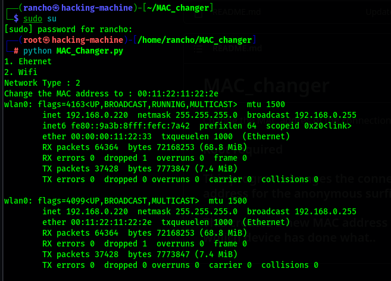

# MAC_changer
Change the MAC addres of the connection untill the connection fails. #MAC

### Root required

### This program changes the connection Make address to a new self defined MAC address for the anonymous surfing and get indetedcted by the service provider,
### This creates a new MAC address to manage the dispute of real service provider, whiich device has done what..
