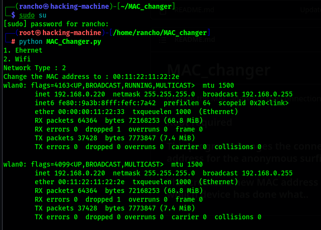

# MAC_changer

## Easiest and beginer friendly tool

To Change the MAC addres of the connection untill the connection fails. 

### Root required

### Usage
```
git clone https://github.com/EngineerRancho/MAC_changer
cd MAC_changer
sudo su
python MAC_changer.py
```
## or
```
git clone https://github.com/EngineerRancho/MAC_changer
cd MAC_changer
sudo su
python3 MAC_Changer_Parsing.py -i [interface] -m [New MAC address]
```

### Drop Your ★★★★★



### This program changes the connection Make address to a new self defined MAC address for the anonymous surfing and get indetedcted by the service provider,
### This creates a new MAC address to manage the dispute of real service provider, whiich device has done what..
